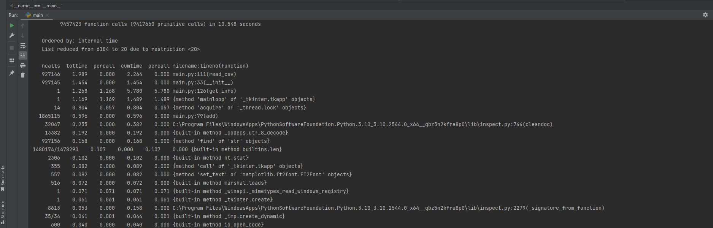

# pythontasks
Это репозиторий с отчётами о выполненных мною заданиях на elearn.

  

**2.3.1**
=====================
Добавил документацию.
-----------------------------------
 

  

**2.3.2**
=====================
Написал тесты, успешно проходятся.
-----------------------------------  
Для некоторых тестов нужна ***тестовая .csv выгрузка***.   
Её необходимо скачать отсюда: https://contest.yandex.ru/contest/40164/problems/5.3/   
Выгрузку надо переименовать в ***vacancies_test.csv*** и поместить в каталог проекта.  
  

  

**2.3.3**
=====================
Выполнил профилирование.
-----------------------------------  
В задании предпологалось, что больше всего времени будет занимать функция по преобразованию даты в строку.  
Однако, в своей программе я не использую **DateTime**, поэтому это исключено.
Больше всего времени занимает парсинг .csv, но в **read_csv()** уже выполнена оптимизация.
Замеры показали, что программа выполняет все действия по обработке данных за 10 секунд, что является хорошим результатом.  
Для профилирования я использовал cProfile. 
Скрипт запускал этой командой: **python -m cProfile -o cprofile.log main.py 10001** .  
Данные сохранены в лог **cprogile.log**. Для их просмотра можно вызвать **Program.print_stats(10)** из **main.py**
  

  

**3.2.1**
=====================
Добавил скрипт chunks.py, разделяющий общую выгрузку на более мелкие.
-----------------------------------  
В chunks.py содержится **split_csv(filename)**.  
Запустите **split_csv**, передав имя выгрузки в качестве параметра.  
Сформированные мелкие выгрузки будут находиться в папке **chunks**.  

