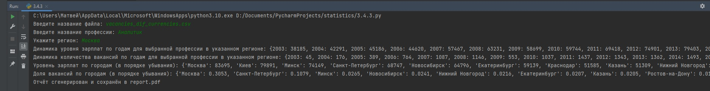

# pythontasks
Это репозиторий с отчётами о выполненных мною заданиях на elearn.

  

**2.3.1**
=====================
Добавил документацию.
-----------------------------------
 

  

**2.3.2**
=====================
Написал тесты, успешно проходятся.
-----------------------------------  
Для некоторых тестов нужна ***тестовая .csv выгрузка***.   
Её необходимо скачать отсюда: https://contest.yandex.ru/contest/40164/problems/5.3/   
Выгрузку надо переименовать в ***vacancies_test.csv*** и поместить в каталог проекта.  
  

  

**2.3.3**
=====================
Выполнил профилирование.
-----------------------------------  
В задании предпологалось, что больше всего времени будет занимать функция по преобразованию даты в строку.  
Однако, в своей программе я не использую **DateTime**, поэтому это исключено.
Больше всего времени занимает парсинг .csv, но в **read_csv()** уже выполнена оптимизация.
Замеры показали, что программа выполняет все действия по обработке данных за 7 с небольшим секунд (без профилизатора меньше)  
, что является хорошим результатом  
Для профилирования я использовал cProfile. 
Скрипт запускал этой командой: **python -m cProfile -o cprofile.log main.py 10001** .  
Данные сохранены в лог **cprogile.log**. Для их просмотра можно вызвать **Program.print_stats(10)** из **main.py**
  

  

**3.2.1**
=====================
Добавил скрипт chunks.py, разделяющий общую выгрузку на более мелкие.
-----------------------------------  
В chunks.py содержится **split_csv(filename)**.  
Запустите **split_csv**, передав имя выгрузки в качестве параметра.  
Сформированные мелкие выгрузки будут находиться в папке **chunks**.  

  

  

**3.2.2**
=====================
Сделал версию программы с **multiprocessing** обработкой файлов из директории chunks.
-----------------------------------  
В **main_multiprocessing.py** содержится новая версия программы.   
С профилизатором новая версия программы запускаться отказалась, поэтому все замеры были выполнены через **datetime**.  
Для достоверности я проводил тесты **10 раз** для каждой версии программы. Версия с **мультипроцессом** всегда завершала работу быстрее.    
### Стандартная версия программы (4.13 c)

  

### Версия с multiprocessing (3.3 c)

  

  

**3.2.3**
=====================
Добавил версию программы с **concurrent.futures** обработкой файлов из директории chunks.
-----------------------------------  
В **main_concurrent.py** содержится новая версия программы.   
С профилизатором запускаться отказалась, как и версия с **multiprocessing**, поэтому все замеры были выполнены через **datetime**.  
Для достоверности я проводил тесты **10 раз**. Версия с **concurrent.futures** показала неоднозначные результаты.  
Версия с **multiprocessing** всегда отрабатывала примерно за одно и то же время, в то время как версия с **concurrent.futures**  
имеет широкий временной диапазон. Я получал результаты от 3.3 до 4 секунд. Среднее время работы (за 10 тестов): **3.5c**.  
Это выше, чем у версии с **multiprocessing**
### Версия программы с concurrent.futures (3.5 c)

  

  

**3.3.1**
=====================
Добавил скрипт **currencies.py** для парсинга курса валют с сайта ЦБ.
-----------------------------------  
В **currencies.py** находится **get_currencies(filename)**  
Вызовите его, передав в качестве аргумента название файла с расширенной выгрузкой.  
Выгрузка должна лежать в том же каталоге, что и скрипт.  
Результат работы скрипта - файл **currencies.csv**.

  

  

**3.3.2**
=====================
Добавил скрипт **3.3.2.py** для задачи **3.3.2**.  
-----------------------------------  
Обработка файла идёт очень долго (у меня выходит примерно 5 минут)!. Но результат точно выведется!  
Для работы скрипта необходимо наличие currencies.csv в каталоге проекта.  
**3.3.2_first100.csv** содержит первые 100 вакансий нового csv.

    

  

**3.3.3**
=====================
Добавил скрипт **hh_parsing.py** для задачи **3.3.3**.  
-----------------------------------     
**HH_vacancies.csv** содержит полученные с сайта вакансии.  
Сюда не вижу смысла прикреплять скриншот, т.к. программа на экран ничего не выводит, только сохраняет выгрузку.  
Выгрузка в файле HH_vacancies.csv  

  

  

**3.4.1**
=====================
Решение в файле 3.3.2.py. Просто переписал его под Pandas.  
-----------------------------------  

  

  

**3.4.2**
=====================
Решение по прежнему в файле 3.3.2.py.  
-----------------------------------     
Имортировал туда класс **report** из **main.py**. Генерируются excel, png, pdf отчёты.  
Т.к. все скрипты генерируют отчёт в файл **report.pdf** - я скопировал отчёт и выгрузил сюда его копию под  
именем **first_report.pdf**, чтобы не было путаницы. Просьба ориентироваться именно на отчеты с GitHub,  
а не с elearn, т.к. я подправил отображение диаграммы и теперь надписи не наезжают друг на друга.

  

  
  
   

  

**3.4.3**
=====================
Добавил скрипт 3.4.3.py.  
-----------------------------------       
Теперь для всех отчётов берётся информация для указанного региона.  
Отчёт генерируется точно такой же, как и раньше, только в нём отсутствуют некоторые показатели, т.к. он ***для указанного региона***.  
Все скрипты генерируют отчёт в один и тот же файл ***report.pdf***, отчёт для этого задания я скопировал и сохранил под именем ***second_report.pdf***  
На elearn файлы по какой-то причине перестали загружаться, поэтому вы можете загрузить отчёт **second_report.pdf** из этого репозитория.  

  

  
  
     
  

  

**3.5.1**
=====================
Решение в файле **3.5.1.py**. База данных в файле **currencies.db**.
-----------------------------------     

  
  

  

**3.5.2**
=====================
Решение в файле **3.5.2.py**. База данных в файле **vacancies_edited.db**.  
Файл с базой данныхсюда загрузить не могу из-за ограничений по размеру, а на elearn не могу из-за ошибки.  
Выслал на почту.
-----------------------------------     

  

  

**3.5.3**
=====================
Решение в файле **3.5.3.py**.
-----------------------------------     

   

  

  

  

  

 

